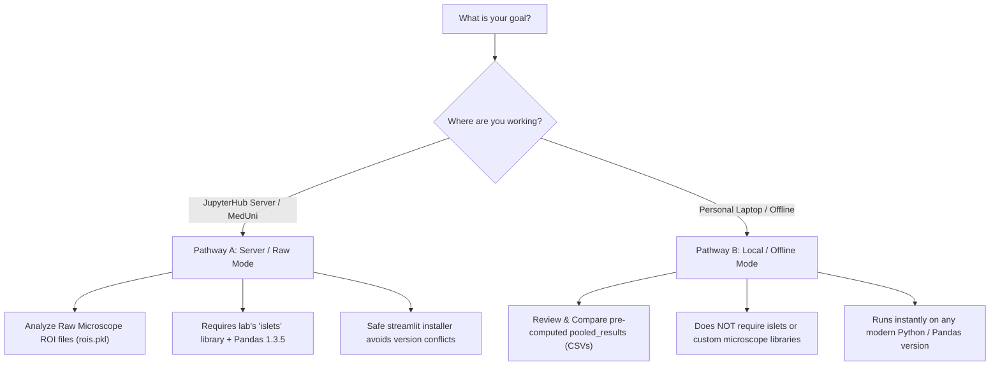

# Calcium analysis

Clean calcium-imaging analysis tools for one experiment, pharmacology phase analysis, or pooled WT/HET/MUT comparison datasets.

This folder contains:

- `thesis_streamlit_app.py` - the interactive Python app.
- `extract_roi_coordinates.py` - standalone helper for creating coordinate CSVs from `rois.pkl`.
- `THESIS_comparison_results_clean.ipynb` - clean comparison-results notebook.
- `THESIS_reproducible_pipeline_from_raw_rois.ipynb` - reproducible raw-data pipeline notebook.
- `generate_thesis_notebooks.py` - script that generated the notebook templates.
- `requirements.txt` - base analysis packages. Streamlit is installed separately with `--no-deps` on the shared server.

## 🚀 Getting Started & Setup Pathways

This analysis suite is designed to be highly portable. Depending on where you are running the tools and what data you have, choose one of the following two pathways:



---

### 📍 Pathway A: Server / Raw Mode (Exact Lab Environment)
> [!NOTE]
> **Use this if:** You are working on the Vienna University server (`ctn2` or equivalent JupyterHub) and need to process raw microscope ROI pickle files (`rois.pkl`), extract coordinates, or recalculate calcium events.

Because raw microscope pickles loaded by the lab's custom `islets` package are strictly dependent on **pandas 1.3.5**, special care must be taken to ensure Streamlit is installed without upgrading your server's pandas version.

#### 1️⃣ Clone the Repository
Open a terminal in JupyterHub and clone this repository into your data directory (replace `<your-username>` with your actual JupyterHub username):
```bash
cd /data/<your-username>/
git clone https://github.com/romihayo-tech/calcium-imaging.git CLEAN_PIPELINES
cd CLEAN_PIPELINES
```

#### 2️⃣ Run the Safe Dependency Installer
Do **NOT** run a plain `pip install streamlit`. This will automatically pull in pandas `2.x`, breaking `islets` and raw data loads. Instead, run our pre-configured safe installer:
```bash
bash install_streamlit_safe.sh
```
This script pins pandas to `1.3.5` via a pip constraint, safely installs `streamlit` and `starlette`, and tests imports to verify everything is aligned.

#### 3️⃣ Launch the App (with reverse proxy port-forwarding)
Since the server runs behind a secure firewall, normal localhost URLs will not open in your local browser. Use our automated launcher, which automatically finds a free port, detects your active user, and prints your custom clickable proxy link:
```bash
/opt/conda/bin/python run_app.py
```
*Alternatively, you can run the standard command: `/opt/conda/bin/python -m streamlit run thesis_streamlit_app.py`, and manually construct your reverse proxy link using the port mapping rule below.*

---

### 📍 Pathway B: Local / Offline Mode (Personal Laptop)
> [!TIP]
> **Use this if:** You are working locally on your personal computer (Mac, Windows, Linux) to analyze, compare, or plot genotype datasets using pre-calculated `pooled_results` folders (pre-generated CSVs) downloaded from the server.

This pathway does **NOT** require the microscope-specific `islets` package or access to raw pickle files, so you can use any standard, modern Python environment (3.8 to 3.11).

#### 1️⃣ Clone the Repository & Setup Environment
Clone the repository to your local machine:
```bash
git clone https://github.com/romihayo-tech/calcium-imaging.git
cd calcium-imaging
```

#### 2️⃣ Install Standard Dependencies
Install standard requirements. Since you are in offline mode, you can safely install `streamlit` normally:
```bash
pip install -r requirements.txt
pip install streamlit
```

#### 3️⃣ Launch the App
Run the Streamlit application directly:
```bash
streamlit run thesis_streamlit_app.py
```
Open the printed local URL (usually `http://localhost:8501`) in your browser.

#### 4️⃣ Load and Analyze Pre-Computed Results
In the app sidebar:
1. Select **Input Mode:** `Existing pooled_results folders`.
2. Provide the folder paths containing your pre-computed `pooled_results` tables (e.g. `pooling_WT/pooled_results`).
3. View and customize comparison graphs, bimodality KDE plots, and phase overlays immediately!

---

## 🔗 JupyterHub Reverse Proxy Guide (For Server Users)

> [!WARNING]
> The standard localhost and internal IP URLs printed by Streamlit at startup will **NOT** work in your local browser when running on a remote server.

Remote JupyterHub environments run behind secure firewalls inside isolated containers. To access Streamlit, you must access it through the **JupyterHub reverse proxy**.

### 🌐 Generic Port Mapping Rule
Map your Streamlit `localhost:<port>` to this pattern in your browser:
```text
https://<your-server-domain>/user/<your-username>/proxy/<port>/
```

### 📝 How to Connect Manually
1. **Find server domain:** Look at your active browser tab's address bar (e.g. `ctn2.physiologie.meduniwien.ac.at`).
2. **Find username:** The active user in your workspace URL path (e.g. `romi`).
3. **Find the running port:** Look at the Streamlit console printout (e.g. `8501`, `8502`).
4. **Assemble the URL:** Replace `/lab` or `/tree` in your active JupyterLab address with `/proxy/<port>/`.

*Examples:*
* **University Server (`ctn2`):**
  * JupyterLab: `https://ctn2.physiologie.meduniwien.ac.at/user/romi/lab`
  * Streamlit Port: `8502`
  * **App Access URL:** `https://ctn2.physiologie.meduniwien.ac.at/user/romi/proxy/8502/`

---

## 🛠️ Server Troubleshooting & Environment Diagnostics

### Verify Pandas Environment (Server Mode)
If you are on the server and suspect a version mismatch has occurred, verify that your active python uses the pinned version:
```bash
/opt/conda/bin/python -c "import pandas as pd; print('Pandas version:', pd.__version__)"
```
It **must** output `Pandas version: 1.3.5`. If pandas was accidentally upgraded, restore it by running:
```bash
/opt/conda/bin/python -m pip install 'pandas==1.3.5'
```

### `Argument 'placement' has incorrect type (expected pandas._libs.internals.BlockPlacement, got slice)`
This error occurs in raw mode when trying to open older `rois.pkl` files with pandas `2.x`. Restoring pandas to `1.3.5` will immediately resolve this issue.

### Missing `starlette` or other imports
If the server environment displays `ModuleNotFoundError: No module named 'starlette'`, re-run the safe installer to automatically resolve missing web packages:
```bash
bash install_streamlit_safe.sh
```

---

## Input Modes

### Existing pooled_results folders

Use this mode when the pooled CSV files already exist.

For each genotype (`WT`, `HET`, `MUT`), provide the folder containing the pooled output tables, for example:

```text
/data/<your-username>/pooling_WT/pooled_results
```

The app reads the cluster tables, ROI-phase tables, and optional coordinate/event CSVs, then writes clean comparison outputs to:

```text
DATA_ROOT/comparison_clean_outputs/
```

### Raw rois/events paths

Use this mode for one experiment or for a full pooling batch starting from raw paths.

Required experiment-table columns:

- `genotype`
- `exp_name`
- `pathToRois`

Optional experiment-table columns:

- `sex`
- `scope`
- `pathToEvents`
- `pathToCoords`

Notes:

- `pathToRois` can point to the real `5.6_rois.pkl` file or to a directory containing it.
- Add one row per experiment/slice. If you enter multiple rows, the app builds a new pooled analysis from those raw paths and compares them side by side.
- `/local_data/...` paths are normalized automatically to `/data/...`.
- If `pathToEvents` is empty, the app derives it from `pathToRois`.
- If `scope` is empty, the app tries to infer it from the path, such as `nd2`, `lif`, or `tiff`.
- The nd2 Y-axis filter is applied only when `scope` is `nd2`. `lif`, `tiff`, `czi`, and unknown scopes are not Y-filtered.

## Protocol Input

Raw mode requires a protocol table. The app supports three input methods:

- Fill the table in the app.
- Upload a CSV file.
- Paste CSV text directly into the app.

Required protocol columns:

- `exp_name`
- `compound`
- `concentration`
- `t_begin`

Optional protocol columns:

- `t_end`

Example:

```csv
exp_name,compound,concentration,t_begin,t_end
exp072a,Glucose,6mM,0,60
exp072a,Glucose,8mM,60,3033.772725
exp072a,ACh,100nM,600,3033.772725
exp072a,Isr,0.1uM,1080,1920
exp072a,Isr,0.5uM,1920,3033.772725
```

`exp_name` in the protocol must exactly match `exp_name` in the experiment table. Times are in seconds from the start of the recording.

The app assigns each phase from its `t_begin` until the next phase's `t_begin`. It also marks the first 200 seconds after each non-first phase as transition time and excludes that transition period from stable ROI-phase metrics.

## Coordinates

The app tries to create ROI coordinates automatically.

Coordinate priority:

1. Use `pathToCoords` if provided.
2. Use `roi`, `x`, and `y` columns from the events CSV if they exist.
3. Open `pathToRois` with `islets.Regions.load_regions`, run `regions.detrend_traces(method="debleach")`, and extract coordinates from `regions.df["peak"]` or other coordinate-like attributes.

When coordinates are calculated successfully in the app, they are also saved to:

```text
DATA_ROOT/comparison_clean_outputs/roi_coordinates_all.csv
```

You can reuse that file later by putting its path in `pathToCoords`.

To create a coordinate CSV outside the app:

```bash
cd /data/<your-username>/CLEAN_PIPELINES
/opt/conda/bin/python extract_roi_coordinates.py \
  --pathToRois "/local_data/Johannes/Imaging/2025/Ctrb1-Δex6/2026-01-11/Experiment279a.nd2_analysis/all/5.6_rois.pkl" \
  --exp_name "279a_F" \
  --genotype "MUT" \
  --scope "nd2" \
  --output "/data/<your-username>/CLEAN_PIPELINES/279a_F_roi_coordinates.csv"
```

Then use `/data/<your-username>/CLEAN_PIPELINES/279a_F_roi_coordinates.csv` in the app's `pathToCoords` column.

If coordinates fail, open the `Coordinate diagnostics` section in the Overview tab. The most important messages are:

- `could not open rois.pkl` - usually a Python/pandas environment mismatch.
- `rois.pkl opened, but no coordinates were found` - the Regions object loaded, but the app could not find coordinate fields.
- `coordinates were found, but none matched the ROI ids in the events table` - ROI labels in the coordinates and events did not match.

The sidebar also contains an `Environment check` section. Use it to compare the Streamlit process against a notebook kernel:

- Python executable
- pandas version
- pandas file location
- Streamlit version
- islets location
- direct `pathToRois` loading test

For older `rois.pkl` files, pandas compatibility matters. The notebooks that successfully load these files currently use pandas `1.3.5`. Avoid upgrading pandas in the server environment unless the old pickles have been converted.

The Streamlit app includes a small compatibility patch before `load_regions` so older pandas pickles that stored internal block placement as a Python `slice`, or that refer to the old `pandas.core.indexes.numeric` module, can still load under newer pandas versions. If ROI loading works in the app but fails in a plain terminal command, this patch is probably the reason.

## GMM Population Analysis

In Raw mode, `Run GMM population analysis` is optional.

Leave it unchecked for ISR/pharmacology/single-experiment phase analysis. In that case, GMM cluster tables and cluster spatial maps will not be created, and this is expected.

Enable it for WT/HET/MUT comparison datasets when you want:

- GMM population structure tables
- cluster labels
- cluster summary figures
- spatial cluster maps

## Phase Analyses

The Phase analysis tab works from ROI-phase metrics and does not require GMM clusters.

It can generate:

- dynamic bimodality KDE plots for any phases present in the data
- a numeric bimodality summary under the plot
- halfwidth overlay across selected phases
- pooling comparison plots across experiments/slices created from raw `pathToRois` rows
- CSV summaries saved to the output folder

The plots are not hardcoded to `10nM ACh` or `100nM ACh`; they use whatever `compound` and `concentration` phases appear in the protocol/data.

Spatial maps update automatically and include controls for:

- spatial metric/phase
- spatial zoom

ROI population selection is intended to use real biological ROI lists:

- `islet` ROI IDs
- `acinar` ROI IDs
- `acinar_clean = acinar - islet`

Do not use microscope normalization filtering as a substitute for these biological lists. If the app needs to separate acinar and islet cells, first identify where these ROI ID lists are stored for each experiment.

## Outputs

Main comparison outputs are saved to:

```text
DATA_ROOT/comparison_clean_outputs/
```

Raw mode also writes pooled-style outputs under:

```text
DATA_ROOT/pooling_<GENOTYPE>/pooled_results/
```

For a first test run, use a separate `DATA_ROOT`, for example:

```text
/data/<your-username>/CLEAN_PIPELINES/test_outputs
```

This avoids mixing test outputs with existing analysis results.

## Troubleshooting

### `streamlit: command not found` or `ModuleNotFoundError: No module named 'starlette'`

Both errors mean Streamlit or one of its dependencies is not installed. Use the safe installer:

```bash
# If Streamlit itself is missing, install it first without deps:
/opt/conda/bin/python -m pip install streamlit --no-deps

# Then fill in the missing dependencies safely:
bash /data/<your-username>/CLEAN_PIPELINES/install_streamlit_safe.sh
```

The safe installer pins pandas to `1.3.5` via a pip constraints file, so it cannot be upgraded even when pip resolves transitive dependencies.

### Do not upgrade pandas

The current server can load old `rois.pkl` files when pandas is:

```text
1.3.5
```

A normal Streamlit install tries to install `pandas-2.3.3`, which causes:

```text
TypeError: Argument 'placement' has incorrect type (expected pandas._libs.internals.BlockPlacement, got slice)
```

Never run a plain `pip install streamlit` or `pip install <anything>` without first checking what it would do to pandas. Use the safe installer or the dry-run check described above.

### `Argument 'placement' has incorrect type`

This usually means the app is using a pandas version that cannot unpickle the old `rois.pkl` files.

Check the terminal environment:

```bash
/opt/conda/bin/python -c "import pandas as pd; print(pd.__version__)"
```

If the notebook can load the ROIs but the Streamlit app cannot, the notebook and Streamlit are probably not using the same Python/pandas environment.

### Many `[autoreload of pandas ... failed]` messages in a notebook

This is usually caused by IPython autoreload trying to reload pandas internals after a package change. Restart the notebook kernel, or run:

```python
%autoreload 0
```

Then import pandas and `load_regions` again in a clean kernel.
